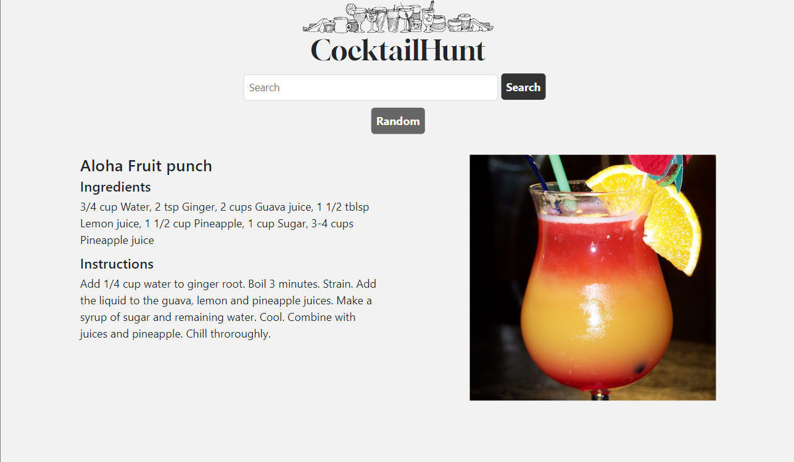

# CocktailHunt

CocktailHunt is an application that allows users to search for cocktail recipes and discover new drinks. The app is built with HTML, CSS, and JavaScript and uses the TheCocktailDB API to retrieve cocktail information.

## Technologies Used
The following technologies were used to build this application:
- Bootstrap HTML
- CSS
- Vanilla JavaScript
- [TheCocktailDB Api](https://www.thecocktaildb.com/api.php)
## Features
The Cocktail Finder App comes with the following features:
- Random cocktail generated every few seconds on page load to give user ideas of drinks to search
- Search for cocktails by name using the input field and search button.
- Get a random cocktail by clicking the "Random" button.
- View cocktail details such as the list of ingredients and instructions for preparation.

### Usage
[Click here to open live demo](https://Wraytheon.github.io/cocktail-API/)
To use the Cocktail Finder App, simply type in the name of the cocktail you want to search for in the search bar and click the search button. The application will then display the picture, name, ingredients and instructions of the cocktail. Alternatively, you can click the "random" button to view a random cocktail.

### Contributing
Contributions to the project are welcome. To contribute, follow these steps:

1. Fork the repository.
2. Create a new branch with a descriptive name for your feature or bug fix.
3. Make changes to the code.
4. Test your changes to make sure they work as expected.
5. Commit your changes.
6. Push your changes to your fork.
7. Submit a pull request.

#### Credits
This application was built using the following resources:
- TheCocktailDB API (https://www.thecocktaildb.com/api.php)
- Bootstrap (https://getbootstrap.com/)
- [Clker-Free-Vector-Images](https://pixabay.com/users/clker-free-vector-images-3736/?utm_source=link-attribution&amp;utm_medium=referral&amp;utm_campaign=image&amp;utm_content=32000) from [Pixabay](https://pixabay.com//?utm_source=link-attribution&amp;utm_medium=referral&amp;utm_campaign=image&amp;utm_content=32000)

#### License
This application is licensed under the MIT license. See LICENSE for more information.